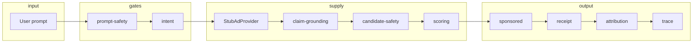

<div align="center">

# GlassBox SSP

**Publisher policy + measurement for in-chat ads**

Hard gates before scoring. Streaming pipeline. Receipts and traces you can export.

<br />

[](https://glassbox-ssp.vercel.app)
[](https://glassbox-ssp.vercel.app?walkthrough=1)
[](https://glassbox-ssp.vercel.app/api/health)
[](https://github.com/mzdifraia/glassbox-ssp)

<br />

| | |
|:---:|:---:|
| **Production** | [glassbox-ssp.vercel.app](https://glassbox-ssp.vercel.app) |
| **Walkthrough UI** | [glassbox-ssp.vercel.app?walkthrough=1](https://glassbox-ssp.vercel.app?walkthrough=1) |
| **Integrations probe** | [glassbox-ssp.vercel.app/api/health](https://glassbox-ssp.vercel.app/api/health) |

</div>

---

## What it does

GlassBox sits on the **publisher** side of AI-native chat. For each user prompt it runs a fixed pipeline: safety → intent → supply → claim checks → auction → sponsored slot or suppression → **transparency receipt** → attribution → trace.

```text
Policy is code, not a score penalty. A higher bid cannot override a block.
```

| Capability | Detail |
|------------|--------|
| Prompt gates | Vulnerability / distress suppresses before any ad request |
| Candidate gates | Unsupported claims, category mismatch, manipulative copy |
| Auction | Stub supply in demo; live bid/relevance jitter unless `?frozen=1` |
| Receipt | Why served, why blocked, data used / stored / not stored |
| Trace | Overmind-ready JSON export per run |

**Track:** Sell-Side & Measurement (Cursor AdTech London hackathon)

---

## Try the live app

Open the site — no install required.

### Recommended first visit

1. Go to **[walkthrough layout](https://glassbox-ssp.vercel.app?walkthrough=1)** (wider panels + “run both scenarios”).
2. Watch the **run status** bar: scenario **A** or **B**, phase (`RUNNING` → `TYPING` → `DONE`), active pipeline step.
3. Click **Run both scenarios (commercial → distress)** or run **A** then **B** separately.

### Scenarios on the site

| Button | What runs | What to notice |
|--------|-----------|----------------|
| **A · Commercial** | Full pipeline + stub auction | HyperBooks blocked on claims despite higher bid |
| **B · Distress** | Stops at prompt safety | `PROMPT_VULNERABILITY_SUPPRESS` — no ad request |
| **Reset** | Clears UI state | Snapshots, trace, panels |

### URL parameters

Append to [glassbox-ssp.vercel.app](https://glassbox-ssp.vercel.app):

| Param | Effect |
|-------|--------|
| [`?walkthrough=1`](https://glassbox-ssp.vercel.app?walkthrough=1) | Walkthrough layout + run-both button |
| [`?fast=1`](https://glassbox-ssp.vercel.app?fast=1) | Skip client pacing between stream events |
| [`?debug=1`](https://glassbox-ssp.vercel.app?debug=1) | Edge toggles (NO_SAFE_ADS, API failure, test seed) |
| [`?seed=golden-safe`](https://glassbox-ssp.vercel.app?seed=golden-safe) | Reproducible auction (same winner each run) |
| [`?frozen=1`](https://glassbox-ssp.vercel.app?frozen=1) | Pin supply metrics (no bid jitter) |

The in-app **System** panel lists pipeline step IDs, HTTP routes, and integration modes (matches production — check [health JSON](https://glassbox-ssp.vercel.app/api/health)).

---

## Architecture



**10 pipeline gates** (IDs match the UI and `overmind/policies.md`):

`prompt-safety` → `intent` → `candidates` → `claim-grounding` → `candidate-safety` → `scoring` → `sponsored` → `receipt` → `attribution` → `trace`

### HTTP API

| Method | Path | Notes |
|--------|------|--------|
| `POST` | `/api/run/stream` | **NDJSON** — `status`, `step`, `candidates`, `complete` ([use from UI](https://glassbox-ssp.vercel.app)) |
| `POST` | `/api/run` | Single JSON `PipelineResult` |
| `GET` | `/api/health` | [Live probe](https://glassbox-ssp.vercel.app/api/health) |
| `GET` | `/api/integrations` | Tavily / supply / Thrad mode |

Example against production:

```bash
curl -s -X POST https://glassbox-ssp.vercel.app/api/run \
  -H 'Content-Type: application/json' \
  -d '{"prompt":"I'\''m choosing accounting software for my 12-person startup.","seed":"golden-safe"}' \
  | jq '{advertiser: .sponsored.advertiser, supply: .integrations.supply, decision: .receipt.placementDecision}'
```

Streaming:

```bash
curl -s -N -X POST https://glassbox-ssp.vercel.app/api/run/stream \
  -H 'Content-Type: application/json' \
  -d '{"prompt":"I'\''m overwhelmed and worried I can'\''t pay my debts."}'
```

---

## Run locally

```bash
git clone https://github.com/mzdifraia/glassbox-ssp.git
cd glassbox-ssp
npm install
cp env.example .env.local   # TAVILY_API_KEY=tvly-... on the same line
npm test
npm run dev
```

Open [http://localhost:3000](http://localhost:3000) — same UI as [production](https://glassbox-ssp.vercel.app), minus your local env keys.

### Environment

| Variable | Demo | Production |
|----------|------|------------|
| `TAVILY_API_KEY` | Optional — hybrid claim grounding | Set on Vercel for [live Tavily](https://glassbox-ssp.vercel.app/api/health) |
| `THRAD_API_KEY` | Not used in hackathon demo | Post-GTM only with `ENABLE_THRAD_GTM=1` |
| `ENABLE_THRAD_GTM` | Leave unset | `1` + Thrad key to swap stub supply |
| `SIMULATE_THRAD_FAILURE` | `?debug=1` UI toggle | Forces ad-provider failure path |

Thrad adapter lives in `src/lib/ads/ThradProvider.ts` behind `AdProvider` — policy, receipts, and attribution stay the same when you flip supply at launch.

---

## Testing & auction modes

Policy outcomes are **stable** (distress always suppressed, HyperBooks blocked on unsupported claims). Auction noise is **live by default** on the [website](https://glassbox-ssp.vercel.app).

| Mode | Trigger | Behaviour |
|------|---------|-----------|
| Live | default | Random bid/relevance jitter |
| Seeded | `seed` in API or `?seed=` | Same PRNG → same winner |
| Frozen | `frozen: true` or `?frozen=1` | No jitter |

```bash
npm test
npm run test:watch
```

---

## Integrations

| Tool | Role in this repo |
|------|-------------------|
| [**Cursor**](https://cursor.com) | Built with Cursor |
| [**Tavily**](https://tavily.com) | Claim grounding when `TAVILY_API_KEY` is set |
| [**Overmind OSS**](https://github.com/overmind-core/overmind) | [`overmind/policies.md`](overmind/policies.md), [`overmind/dataset.json`](overmind/dataset.json), trace export in UI |
| **Thrad** | `ThradProvider` for GTM — stub supply in [live demo](https://glassbox-ssp.vercel.app) |

Export a trace after any run on the site → **Export trace JSON** (compatible with Overmind eval fixtures).

---

## Repo map

```text
src/lib/pipeline/runPipeline.ts   orchestrator
src/lib/safety/                   prompt + candidate gates
src/lib/claims/                   hard-block + Tavily
src/lib/scoring/                  composite auction score
src/lib/ads/                      StubAdProvider · ThradProvider
src/app/api/run/stream/           streaming endpoint
overmind/                         policies + golden dataset
```

---

## Hackathon submission

See [`SUBMISSION.md`](SUBMISSION.md) for links and a short walkthrough aligned with the [live walkthrough UI](https://glassbox-ssp.vercel.app?walkthrough=1).

**One line:** GlassBox decides when a chat may show ads, which candidate wins under policy, why, and how to audit it.

---

<div align="center">

**[Open live demo →](https://glassbox-ssp.vercel.app)** · **[Walkthrough →](https://glassbox-ssp.vercel.app?walkthrough=1)** · **[Health check →](https://glassbox-ssp.vercel.app/api/health)**

</div>
